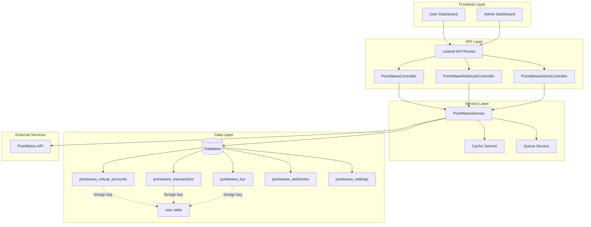
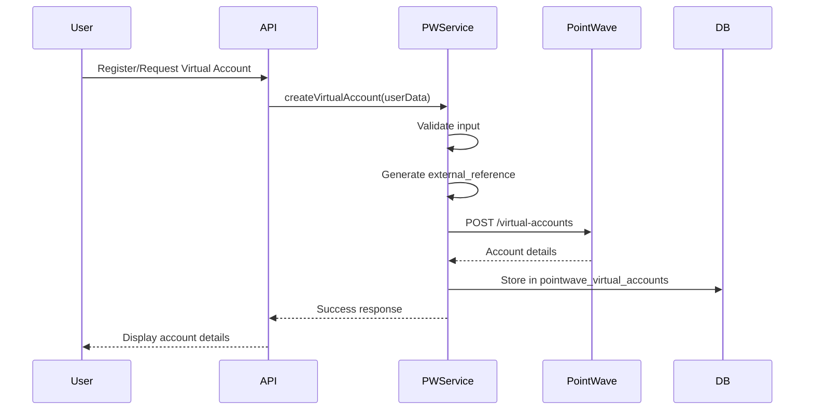
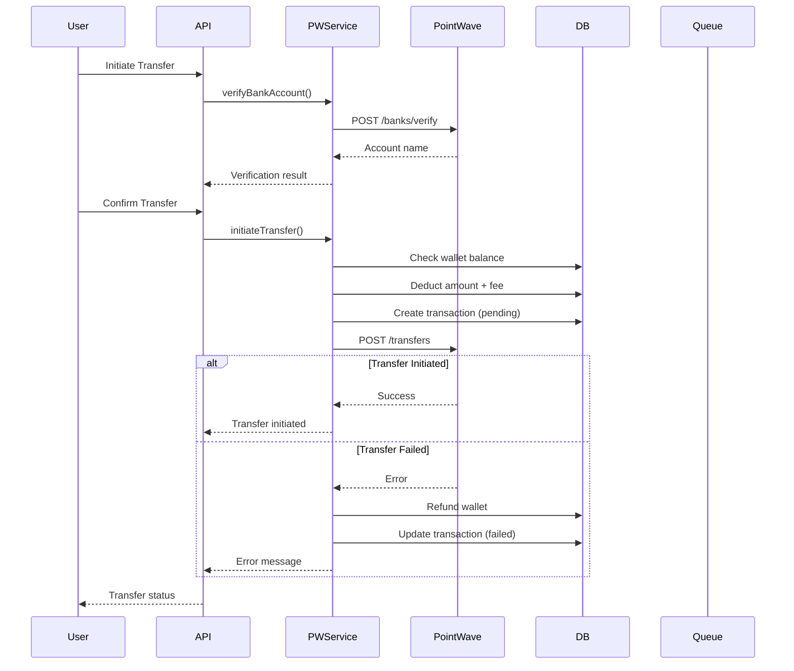
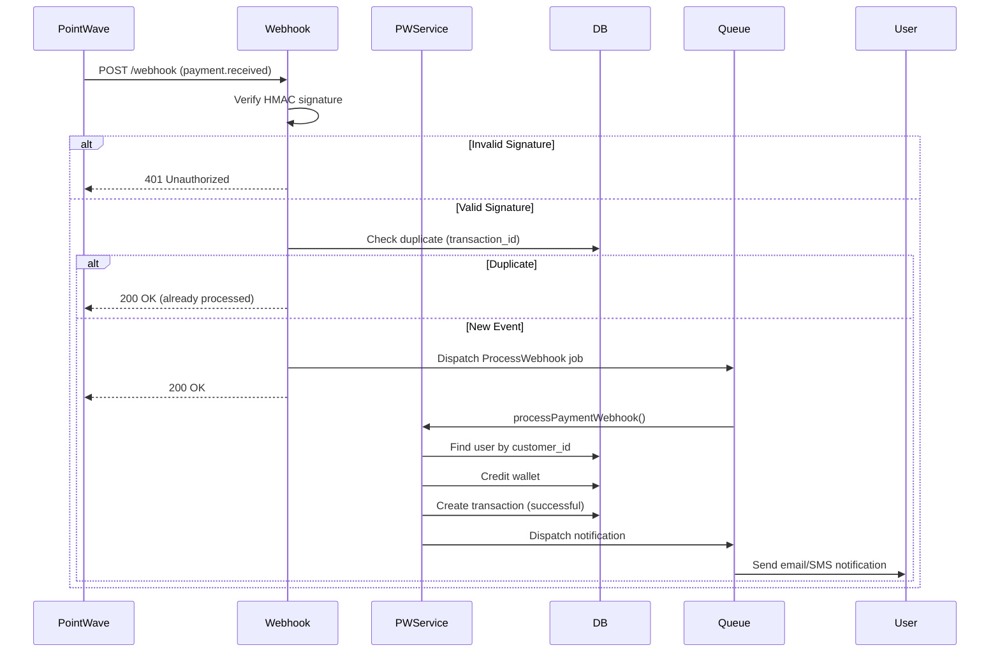

# Design Document: PointWave Integration

## Overview

### Purpose

This design document specifies the technical architecture for integrating the PointWave payment gateway (via PalmPay) into the Kobopoint Laravel VTU/Payment platform. The integration enables users to create virtual accounts for receiving payments, send bank transfers to Nigerian bank accounts, and receive real-time payment notifications via webhooks.

### Scope

The PointWave integration will:
- Add PointWave as an additional payment provider (not a replacement)
- Create new database tables with "pointwave_" prefix to avoid conflicts
- Integrate with existing user authentication and wallet systems
- Work alongside existing providers (Xixapay, Paystack, Monnify)
- Preserve all existing functionality and routes

### Key Features

1. **Virtual Account Management**: Automatic creation of PalmPay virtual accounts for users
2. **Bank Transfers**: Initiate transfers to any Nigerian bank account via PointWave
3. **Webhook Processing**: Real-time payment notifications and status updates
4. **KYC Integration**: Support for BVN/NIN verification with tier-based limits
5. **Transaction Management**: Comprehensive tracking and reconciliation
6. **Admin Controls**: Configuration, monitoring, and manual intervention capabilities

### Design Principles

1. **Non-Breaking**: Use only incremental migrations (new tables only)
2. **Isolated**: Separate tables and namespaces to avoid conflicts
3. **Secure**: HMAC signature verification, encryption, input validation
4. **Resilient**: Retry logic, error handling, transaction rollback
5. **Observable**: Comprehensive logging and monitoring

## Architecture

### High-Level Component Diagram




### Data Flow Diagrams

#### Virtual Account Creation Flow



#### Bank Transfer Flow



#### Webhook Processing Flow



### Integration Points with Existing System

#### 1. User Registration Integration
- Hook into existing user registration flow
- Automatically create PointWave virtual account after user creation
- Store virtual account details in separate `pointwave_virtual_accounts` table
- Link via foreign key to existing `user` table (user.id)

#### 2. Wallet System Integration
- Use existing `user.bal` column for wallet balance
- PointWave deposits credit `user.bal` directly
- PointWave transfers deduct from `user.bal`
- Maintain transaction atomicity with database transactions

#### 3. Transfer Provider Selection
- Add PointWave to existing transfer provider dropdown
- Check `pointwave_settings.enabled` flag before displaying
- Use existing transfer UI with PointWave-specific fields
- Store PointWave transfers in separate `pointwave_transactions` table

#### 4. Transaction History Integration
- Display PointWave transactions alongside existing transactions
- Add "PointWave" badge to distinguish from other providers
- Use existing transaction list UI with additional filtering

#### 5. Notification System Integration
- Use existing Laravel notification system
- Queue notifications for async processing
- Support email, SMS, and in-app notifications
- Reuse existing notification templates with PointWave branding

## Components and Interfaces

### Service Layer

#### PointWaveService

**Location**: `app/Services/PointWaveService.php` (already exists, will be enhanced)

**Responsibilities**:
- API communication with PointWave gateway
- Request/response handling and error management
- Retry logic and timeout handling
- Logging and monitoring

**Key Methods**:

```php
class PointWaveService
{
    // Virtual Account Management
    public function createVirtualAccount(array $data): array
    public function getVirtualAccount(string $customerId): array
    
    // Bank Operations
    public function getBanks(): array
    public function verifyBankAccount(string $accountNumber, string $bankCode): array
    
    // Transfer Operations
    public function initiateTransfer(array $data): array
    public function getTransfer(string $reference): array
    
    // Transaction Management
    public function getTransactions(array $filters = []): array
    public function getTransaction(string $transactionId): array
    
    // Wallet Operations
    public function getWalletBalance(): array
    
    // Customer Management
    public function getCustomer(string $customerId): array
    public function updateCustomer(string $customerId, array $data): array
    
    // Internal Helpers
    private function getHeaders(bool $includeIdempotency = false): array
    private function handleApiError(\Exception $e): array
    private function retryRequest(callable $request, int $maxRetries = 2): array
}
```


### Controller Layer

#### PointWaveController

**Location**: `app/Http/Controllers/API/PointWaveController.php`

**Responsibilities**:
- Handle user-facing API endpoints
- Input validation and sanitization
- Business logic orchestration
- Response formatting

**Endpoints**:

```php
class PointWaveController extends Controller
{
    // GET /api/pointwave/virtual-account
    public function getVirtualAccount(Request $request)
    
    // POST /api/pointwave/virtual-account/create
    public function createVirtualAccount(Request $request)
    
    // GET /api/pointwave/banks
    public function getBanks(Request $request)
    
    // POST /api/pointwave/verify-account
    public function verifyAccount(Request $request)
    
    // POST /api/pointwave/transfer
    public function initiateTransfer(Request $request)
    
    // GET /api/pointwave/transactions
    public function getTransactions(Request $request)
    
    // GET /api/pointwave/transactions/{reference}
    public function getTransaction(Request $request, string $reference)
    
    // POST /api/pointwave/kyc/submit
    public function submitKYC(Request $request)
}
```

#### PointWaveWebhookController

**Location**: `app/Http/Controllers/API/PointWaveWebhookController.php`

**Responsibilities**:
- Receive and validate webhook requests
- Verify HMAC signatures
- Dispatch webhook processing jobs
- Return appropriate HTTP responses

**Endpoints**:

```php
class PointWaveWebhookController extends Controller
{
    // POST /api/pointwave/webhook
    public function handleWebhook(Request $request)
    
    // Internal methods
    private function verifySignature(Request $request): bool
    private function processPaymentReceived(array $payload): void
    private function processTransferSuccess(array $payload): void
    private function processTransferFailed(array $payload): void
    private function isDuplicate(string $transactionId): bool
}
```

#### PointWaveAdminController

**Location**: `app/Http/Controllers/Admin/PointWaveAdminController.php`

**Responsibilities**:
- Admin dashboard and configuration
- Transaction monitoring and management
- Reconciliation operations
- Manual interventions

**Endpoints**:

```php
class PointWaveAdminController extends Controller
{
    // GET /admin/pointwave/dashboard
    public function dashboard(Request $request)
    
    // GET /admin/pointwave/transactions
    public function transactions(Request $request)
    
    // POST /admin/pointwave/transactions/{id}/refund
    public function refundTransaction(Request $request, int $id)
    
    // GET /admin/pointwave/settings
    public function getSettings(Request $request)
    
    // POST /admin/pointwave/settings
    public function updateSettings(Request $request)
    
    // POST /admin/pointwave/reconcile
    public function reconcile(Request $request)
    
    // GET /admin/pointwave/balance
    public function getBalance(Request $request)
}
```

### Model Layer

#### PointWaveVirtualAccount

**Location**: `app/Models/PointWaveVirtualAccount.php`

```php
class PointWaveVirtualAccount extends Model
{
    protected $table = 'pointwave_virtual_accounts';
    
    protected $fillable = [
        'user_id',
        'customer_id',
        'account_number',
        'account_name',
        'bank_name',
        'bank_code',
        'status',
        'external_reference',
    ];
    
    protected $casts = [
        'created_at' => 'datetime',
        'updated_at' => 'datetime',
    ];
    
    // Relationships
    public function user()
    {
        return $this->belongsTo(User::class);
    }
}
```

#### PointWaveTransaction

**Location**: `app/Models/PointWaveTransaction.php`

```php
class PointWaveTransaction extends Model
{
    protected $table = 'pointwave_transactions';
    
    protected $fillable = [
        'user_id',
        'type',
        'amount',
        'fee',
        'status',
        'reference',
        'pointwave_transaction_id',
        'pointwave_customer_id',
        'account_number',
        'bank_code',
        'account_name',
        'narration',
        'metadata',
    ];
    
    protected $casts = [
        'amount' => 'decimal:2',
        'fee' => 'decimal:2',
        'metadata' => 'array',
        'created_at' => 'datetime',
        'updated_at' => 'datetime',
    ];
    
    // Relationships
    public function user()
    {
        return $this->belongsTo(User::class);
    }
    
    // Scopes
    public function scopeDeposits($query)
    {
        return $query->where('type', 'deposit');
    }
    
    public function scopeTransfers($query)
    {
        return $query->where('type', 'transfer');
    }
    
    public function scopePending($query)
    {
        return $query->where('status', 'pending');
    }
    
    public function scopeSuccessful($query)
    {
        return $query->where('status', 'successful');
    }
}
```

#### PointWaveKYC

**Location**: `app/Models/PointWaveKYC.php`

```php
class PointWaveKYC extends Model
{
    protected $table = 'pointwave_kyc';
    
    protected $fillable = [
        'user_id',
        'id_type',
        'id_number_encrypted',
        'kyc_status',
        'tier',
        'daily_limit',
        'verified_at',
    ];
    
    protected $casts = [
        'daily_limit' => 'decimal:2',
        'verified_at' => 'datetime',
        'created_at' => 'datetime',
        'updated_at' => 'datetime',
    ];
    
    // Relationships
    public function user()
    {
        return $this->belongsTo(User::class);
    }
    
    // Accessors
    public function getIdNumberAttribute()
    {
        return decrypt($this->id_number_encrypted);
    }
    
    // Mutators
    public function setIdNumberAttribute($value)
    {
        $this->attributes['id_number_encrypted'] = encrypt($value);
    }
}
```

#### PointWaveWebhook

**Location**: `app/Models/PointWaveWebhook.php`

```php
class PointWaveWebhook extends Model
{
    protected $table = 'pointwave_webhooks';
    
    protected $fillable = [
        'event_type',
        'payload',
        'signature',
        'processed',
        'processed_at',
        'error_message',
    ];
    
    protected $casts = [
        'payload' => 'array',
        'processed' => 'boolean',
        'processed_at' => 'datetime',
        'created_at' => 'datetime',
    ];
    
    // Scopes
    public function scopeUnprocessed($query)
    {
        return $query->where('processed', false);
    }
    
    public function scopeByEventType($query, string $eventType)
    {
        return $query->where('event_type', $eventType);
    }
}
```

#### PointWaveSetting

**Location**: `app/Models/PointWaveSetting.php`

```php
class PointWaveSetting extends Model
{
    protected $table = 'pointwave_settings';
    
    public $timestamps = false;
    
    protected $fillable = [
        'key',
        'value',
        'updated_by',
        'updated_at',
    ];
    
    protected $casts = [
        'updated_at' => 'datetime',
    ];
    
    // Helper methods
    public static function get(string $key, $default = null)
    {
        $setting = self::where('key', $key)->first();
        return $setting ? $setting->value : $default;
    }
    
    public static function set(string $key, $value, int $updatedBy = null)
    {
        return self::updateOrCreate(
            ['key' => $key],
            [
                'value' => $value,
                'updated_by' => $updatedBy,
                'updated_at' => now(),
            ]
        );
    }
}
```


### Job Layer

#### ProcessPointWaveWebhook

**Location**: `app/Jobs/ProcessPointWaveWebhook.php`

```php
class ProcessPointWaveWebhook implements ShouldQueue
{
    use Dispatchable, InteractsWithQueue, Queueable, SerializesModels;
    
    public $tries = 3;
    public $timeout = 60;
    
    protected $webhookData;
    
    public function __construct(array $webhookData)
    {
        $this->webhookData = $webhookData;
    }
    
    public function handle(PointWaveService $service)
    {
        // Process webhook based on event type
        // Handle payment.received, transfer.success, transfer.failed
    }
    
    public function failed(\Exception $exception)
    {
        // Log failure and alert admin
    }
}
```

#### SendPointWaveNotification

**Location**: `app/Jobs/SendPointWaveNotification.php`

```php
class SendPointWaveNotification implements ShouldQueue
{
    use Dispatchable, InteractsWithQueue, Queueable, SerializesModels;
    
    public $tries = 3;
    
    protected $user;
    protected $notificationType;
    protected $data;
    
    public function __construct(User $user, string $notificationType, array $data)
    {
        $this->user = $user;
        $this->notificationType = $notificationType;
        $this->data = $data;
    }
    
    public function handle()
    {
        // Send email, SMS, and in-app notifications
    }
}
```

### Middleware

#### VerifyPointWaveWebhook

**Location**: `app/Http/Middleware/VerifyPointWaveWebhook.php`

```php
class VerifyPointWaveWebhook
{
    public function handle(Request $request, Closure $next)
    {
        $signature = $request->header('X-Pointwave-Signature');
        $payload = $request->getContent();
        $secret = env('POINTWAVE_SECRET_KEY');
        
        $expectedSignature = hash_hmac('sha256', $payload, $secret);
        
        if (!hash_equals($expectedSignature, $signature)) {
            Log::warning('Invalid PointWave webhook signature', [
                'ip' => $request->ip(),
                'signature' => $signature,
            ]);
            
            return response()->json([
                'success' => false,
                'message' => 'Invalid signature'
            ], 401);
        }
        
        return $next($request);
    }
}
```

#### RateLimitPointWave

**Location**: `app/Http/Middleware/RateLimitPointWave.php`

```php
class RateLimitPointWave
{
    public function handle(Request $request, Closure $next)
    {
        $key = 'pointwave_api_' . auth()->id();
        $limit = 60; // 60 requests per minute
        
        if (Cache::has($key) && Cache::get($key) >= $limit) {
            return response()->json([
                'success' => false,
                'message' => 'Rate limit exceeded. Please try again later.'
            ], 429);
        }
        
        Cache::increment($key, 1);
        Cache::put($key, Cache::get($key), now()->addMinute());
        
        return $next($request);
    }
}
```

## Data Models

### Database Schema

#### pointwave_virtual_accounts

```sql
CREATE TABLE pointwave_virtual_accounts (
    id BIGINT UNSIGNED AUTO_INCREMENT PRIMARY KEY,
    user_id BIGINT UNSIGNED NOT NULL,
    customer_id VARCHAR(100) NOT NULL,
    account_number VARCHAR(20) NOT NULL,
    account_name VARCHAR(255) NOT NULL,
    bank_name VARCHAR(100) NOT NULL,
    bank_code VARCHAR(10) NOT NULL DEFAULT '100033',
    status ENUM('active', 'inactive', 'suspended') DEFAULT 'active',
    external_reference VARCHAR(100) UNIQUE,
    created_at TIMESTAMP DEFAULT CURRENT_TIMESTAMP,
    updated_at TIMESTAMP DEFAULT CURRENT_TIMESTAMP ON UPDATE CURRENT_TIMESTAMP,
    
    UNIQUE KEY unique_user (user_id),
    UNIQUE KEY unique_customer (customer_id),
    UNIQUE KEY unique_account (account_number),
    INDEX idx_user_id (user_id),
    INDEX idx_customer_id (customer_id),
    INDEX idx_status (status),
    
    FOREIGN KEY (user_id) REFERENCES user(id) ON DELETE CASCADE
) ENGINE=InnoDB DEFAULT CHARSET=utf8mb4 COLLATE=utf8mb4_unicode_ci;
```

#### pointwave_transactions

```sql
CREATE TABLE pointwave_transactions (
    id BIGINT UNSIGNED AUTO_INCREMENT PRIMARY KEY,
    user_id BIGINT UNSIGNED NOT NULL,
    type ENUM('deposit', 'transfer', 'withdrawal') NOT NULL,
    amount DECIMAL(15, 2) NOT NULL,
    fee DECIMAL(10, 2) DEFAULT 0.00,
    status ENUM('pending', 'successful', 'failed', 'refunded') DEFAULT 'pending',
    reference VARCHAR(100) NOT NULL UNIQUE,
    pointwave_transaction_id VARCHAR(100),
    pointwave_customer_id VARCHAR(100),
    account_number VARCHAR(20),
    bank_code VARCHAR(10),
    account_name VARCHAR(255),
    narration TEXT,
    metadata JSON,
    created_at TIMESTAMP DEFAULT CURRENT_TIMESTAMP,
    updated_at TIMESTAMP DEFAULT CURRENT_TIMESTAMP ON UPDATE CURRENT_TIMESTAMP,
    
    INDEX idx_user_id (user_id),
    INDEX idx_type (type),
    INDEX idx_status (status),
    INDEX idx_reference (reference),
    INDEX idx_pointwave_transaction_id (pointwave_transaction_id),
    INDEX idx_created_at (created_at),
    INDEX idx_user_type_status (user_id, type, status),
    
    FOREIGN KEY (user_id) REFERENCES user(id) ON DELETE CASCADE
) ENGINE=InnoDB DEFAULT CHARSET=utf8mb4 COLLATE=utf8mb4_unicode_ci;
```

#### pointwave_kyc

```sql
CREATE TABLE pointwave_kyc (
    id BIGINT UNSIGNED AUTO_INCREMENT PRIMARY KEY,
    user_id BIGINT UNSIGNED NOT NULL,
    id_type ENUM('bvn', 'nin') NOT NULL,
    id_number_encrypted TEXT NOT NULL,
    kyc_status ENUM('not_submitted', 'pending', 'verified', 'rejected') DEFAULT 'not_submitted',
    tier ENUM('tier_1', 'tier_3') DEFAULT 'tier_1',
    daily_limit DECIMAL(15, 2) DEFAULT 300000.00,
    verified_at TIMESTAMP NULL,
    created_at TIMESTAMP DEFAULT CURRENT_TIMESTAMP,
    updated_at TIMESTAMP DEFAULT CURRENT_TIMESTAMP ON UPDATE CURRENT_TIMESTAMP,
    
    UNIQUE KEY unique_user (user_id),
    INDEX idx_kyc_status (kyc_status),
    INDEX idx_tier (tier),
    
    FOREIGN KEY (user_id) REFERENCES user(id) ON DELETE CASCADE
) ENGINE=InnoDB DEFAULT CHARSET=utf8mb4 COLLATE=utf8mb4_unicode_ci;
```

#### pointwave_webhooks

```sql
CREATE TABLE pointwave_webhooks (
    id BIGINT UNSIGNED AUTO_INCREMENT PRIMARY KEY,
    event_type VARCHAR(50) NOT NULL,
    payload JSON NOT NULL,
    signature VARCHAR(255) NOT NULL,
    processed BOOLEAN DEFAULT FALSE,
    processed_at TIMESTAMP NULL,
    error_message TEXT,
    created_at TIMESTAMP DEFAULT CURRENT_TIMESTAMP,
    
    INDEX idx_event_type (event_type),
    INDEX idx_processed (processed),
    INDEX idx_created_at (created_at),
    INDEX idx_processed_created (processed, created_at)
) ENGINE=InnoDB DEFAULT CHARSET=utf8mb4 COLLATE=utf8mb4_unicode_ci;
```

#### pointwave_settings

```sql
CREATE TABLE pointwave_settings (
    id BIGINT UNSIGNED AUTO_INCREMENT PRIMARY KEY,
    `key` VARCHAR(100) NOT NULL UNIQUE,
    `value` TEXT NOT NULL,
    updated_by BIGINT UNSIGNED,
    updated_at TIMESTAMP DEFAULT CURRENT_TIMESTAMP ON UPDATE CURRENT_TIMESTAMP,
    
    INDEX idx_key (`key`)
) ENGINE=InnoDB DEFAULT CHARSET=utf8mb4 COLLATE=utf8mb4_unicode_ci;
```

### Default Settings

The following settings will be seeded during migration:

```php
[
    'pointwave_enabled' => 'true',
    'pointwave_transfer_fee' => '50.00',
    'pointwave_min_transfer' => '100.00',
    'pointwave_max_transfer' => '5000000.00',
    'pointwave_auto_create_virtual_account' => 'true',
    'pointwave_webhook_secret' => env('POINTWAVE_SECRET_KEY'),
]
```

### Entity Relationships

```mermaid
erDiagram
    user ||--o| pointwave_virtual_accounts : has
    user ||--o{ pointwave_transactions : initiates
    user ||--o| pointwave_kyc : has
    
    user {
        bigint id PK
        string name
        string email
        string phone
        decimal bal
        string type
    }
    
    pointwave_virtual_accounts {
        bigint id PK
        bigint user_id FK
        string customer_id UK
        string account_number UK
        string account_name
        string bank_name
        string bank_code
        enum status
        string external_reference UK
        timestamp created_at
        timestamp updated_at
    }
    
    pointwave_transactions {
        bigint id PK
        bigint user_id FK
        enum type
        decimal amount
        decimal fee
        enum status
        string reference UK
        string pointwave_transaction_id
        string pointwave_customer_id
        string account_number
        string bank_code
        string account_name
        text narration
        json metadata
        timestamp created_at
        timestamp updated_at
    }
    
    pointwave_kyc {
        bigint id PK
        bigint user_id FK UK
        enum id_type
        text id_number_encrypted
        enum kyc_status
        enum tier
        decimal daily_limit
        timestamp verified_at
        timestamp created_at
        timestamp updated_at
    }
    
    pointwave_webhooks {
        bigint id PK
        string event_type
        json payload
        string signature
        boolean processed
        timestamp processed_at
        text error_message
        timestamp created_at
    }
    
    pointwave_settings {
        bigint id PK
        string key UK
        text value
        bigint updated_by
        timestamp updated_at
    }
```


## Correctness Properties

A property is a characteristic or behavior that should hold true across all valid executions of a system—essentially, a formal statement about what the system should do. Properties serve as the bridge between human-readable specifications and machine-verifiable correctness guarantees.

### Property 1: Virtual Account User Uniqueness

For any user in the system, there should be at most one active virtual account associated with that user.

**Validates: Requirements 1.4, 1.12**

### Property 2: Virtual Account Required Fields

For any virtual account created, the database record must contain all required fields: account_number, bank_name, account_name, and customer_id.

**Validates: Requirements 1.3**

### Property 3: Virtual Account Default Values

For any virtual account created without explicit account_type or bank_code, the account_type should be "static" and bank_code should be "100033".

**Validates: Requirements 1.7, 1.8**

### Property 4: Virtual Account Reference Uniqueness

For any two virtual account creation requests, the generated external_reference values should be different.

**Validates: Requirements 1.9**

### Property 5: Transfer Fee Calculation

For any transfer initiated, the total deduction from the user's wallet should equal the transfer amount plus ₦50.

**Validates: Requirements 2.2, 2.5**

### Property 6: Transfer Amount Validation

For any transfer request, if the amount is less than ₦100 or greater than ₦5,000,000, the transfer should be rejected.

**Validates: Requirements 2.3, 2.4**

### Property 7: Transfer Reference Format

For any transfer initiated, the generated reference should match the pattern "PW-{timestamp}-{user_id}" and be unique.

**Validates: Requirements 2.6**

### Property 8: Transfer Insufficient Balance Rejection

For any transfer request where the user's wallet balance is less than (amount + ₦50), the transfer should be rejected and the wallet should remain unchanged.

**Validates: Requirements 2.10**

### Property 9: Transfer Rollback on Failure

For any transfer that fails after wallet deduction, the user's wallet balance should be restored to its original value.

**Validates: Requirements 2.12**

### Property 10: Transfer Pending Status

For any transfer initiated successfully, a transaction record with status "pending" should be created immediately.

**Validates: Requirements 2.9**

### Property 11: Account Verification Caching

For any bank account verification, if the same account_number and bank_code combination is verified again within 24 hours, the cached result should be returned without calling the API.

**Validates: Requirements 3.7**

### Property 12: Webhook Signature Verification

For any incoming webhook request, if the HMAC signature does not match the computed signature using SHA256, the webhook should be rejected with HTTP 401 status.

**Validates: Requirements 4.1, 4.2, 10.1, 10.2, 10.3, 10.4**

### Property 13: Webhook Idempotency

For any webhook with a given transaction_id, processing it multiple times should only credit the wallet once.

**Validates: Requirements 4.9, 5.9**

### Property 14: Payment Webhook Wallet Credit

For any valid "payment.received" webhook, the user's wallet balance should increase by exactly the payment amount.

**Validates: Requirements 4.5**

### Property 15: Payment Webhook Transaction Record

For any valid "payment.received" webhook, a transaction record with type "deposit" and status "successful" should be created.

**Validates: Requirements 4.6**

### Property 16: Transfer Success Status Update

For any valid "transfer.success" webhook, the corresponding transaction record status should be updated from "pending" to "successful".

**Validates: Requirements 5.2**

### Property 17: Transfer Failure Refund

For any valid "transfer.failed" webhook, the user's wallet should be credited with the transfer amount plus ₦50 fee, and the transaction status should be "failed".

**Validates: Requirements 5.5, 5.6**

### Property 18: Transaction User Association

For any transaction record created, it must have a valid user_id that references an existing user in the user table.

**Validates: Requirements 6.9**

### Property 19: Transaction Type Constraint

For any transaction record, the type field must be one of: "deposit", "transfer", or "withdrawal".

**Validates: Requirements 6.2**

### Property 20: Transaction Status Constraint

For any transaction record, the status field must be one of: "pending", "successful", or "failed".

**Validates: Requirements 6.3**

### Property 21: Transaction Filtering by User

For any user requesting their transaction history, only transactions where user_id matches the requesting user should be returned.

**Validates: Requirements 6.4**

### Property 22: Transaction Pagination

For any transaction list request without a specified limit, the response should contain at most 20 transactions per page.

**Validates: Requirements 6.6**

### Property 23: KYC ID Type Validation

For any KYC submission, the id_type must be either "bvn" or "nin", and no other values should be accepted.

**Validates: Requirements 7.1**

### Property 24: KYC ID Number Length

For any KYC submission with id_type "bvn" or "nin", the id_number must be exactly 11 digits.

**Validates: Requirements 7.2, 7.3**

### Property 25: KYC ID Number Encryption

For any KYC record stored in the database, the id_number_encrypted field should not contain the plaintext id_number.

**Validates: Requirements 7.5**

### Property 26: KYC Status Constraint

For any KYC record, the kyc_status must be one of: "not_submitted", "pending", "verified", or "rejected".

**Validates: Requirements 7.6**

### Property 27: KYC Tier Upgrade

For any user whose KYC status changes to "verified", the tier should be updated to "tier_3" and daily_limit to ₦5,000,000.

**Validates: Requirements 7.7**

### Property 28: Default Tier Assignment

For any user without KYC information, the tier should be "tier_1" with a daily_limit of ₦300,000.

**Validates: Requirements 7.8**

### Property 29: Tier-Based Transfer Limit Enforcement

For any transfer request, if the amount exceeds the user's daily_limit based on their tier, the transfer should be rejected.

**Validates: Requirements 7.9**

### Property 30: Webhook Payload Parsing Round-Trip

For any valid webhook payload, parsing it to a WebhookEvent object, then serializing it back to JSON, then parsing again should produce an equivalent object.

**Validates: Requirements 19.7**

### Property 31: Webhook Required Fields Validation

For any webhook payload, if it is missing required fields (event_type, data, timestamp), the parser should reject it with a descriptive error.

**Validates: Requirements 19.3**

### Property 32: Webhook Amount Field Type Validation

For any webhook payload, all amount fields must be numeric values, and non-numeric values should be rejected.

**Validates: Requirements 19.4**

### Property 33: Webhook Timestamp Format Validation

For any webhook payload, timestamp fields must be in ISO 8601 format, and invalid formats should be rejected.

**Validates: Requirements 19.5**

### Property 34: Webhook Event Type Support

For any webhook received, the event_type must be one of: "payment.received", "transfer.success", or "transfer.failed".

**Validates: Requirements 19.10**

### Property 35: API Response Parsing Round-Trip

For any valid API response object, parsing it from JSON, then serializing it back to JSON, then parsing again should produce an equivalent object.

**Validates: Requirements 20.7**

### Property 36: API Error Response Parsing

For any API error response, the parser should extract both the error code and error message fields.

**Validates: Requirements 20.2**

### Property 37: API Response Null Field Handling

For any API response with null or missing optional fields, the parser should handle them gracefully without throwing errors.

**Validates: Requirements 20.8**

### Property 38: API Amount String Conversion

For any API response containing amount fields as strings, the parser should convert them to numeric types.

**Validates: Requirements 20.9**

### Property 39: API Timestamp Parsing

For any API response containing ISO 8601 timestamp strings, the parser should convert them to DateTime objects.

**Validates: Requirements 20.10**


## Error Handling

### Error Categories

#### 1. API Communication Errors

**Timeout Errors**
- Timeout: 30 seconds for all API requests
- Retry: Up to 2 times with exponential backoff (1s, 2s)
- Fallback: Return user-friendly error message
- Logging: Log full request/response details

**Network Errors**
- Catch: Connection refused, DNS failures, SSL errors
- Retry: Once after 5 seconds
- Fallback: Return "Service temporarily unavailable"
- Logging: Log error with request context

**HTTP Error Codes**
- 401 Unauthorized: Log "Invalid credentials", alert admin, return auth error
- 429 Too Many Requests: Implement exponential backoff, queue request
- 500 Internal Server Error: Retry once after 5 seconds, log error
- 400 Bad Request: Log validation error, return specific error message
- 404 Not Found: Log error, return "Resource not found"

#### 2. Validation Errors

**Input Validation**
```php
// Transfer validation example
$validator = Validator::make($request->all(), [
    'amount' => 'required|numeric|min:100|max:5000000',
    'account_number' => 'required|digits:10',
    'bank_code' => 'required|exists:unified_banks,code',
    'narration' => 'nullable|string|max:255',
]);

if ($validator->fails()) {
    return response()->json([
        'success' => false,
        'errors' => $validator->errors()
    ], 422);
}
```

**Business Logic Validation**
- Insufficient balance: Check before deduction, return specific error
- Duplicate virtual account: Check uniqueness, return existing account
- Invalid KYC: Validate format and length, return validation errors
- Tier limit exceeded: Check daily limit, return limit information

#### 3. Webhook Processing Errors

**Signature Verification Failure**
```php
if (!$this->verifySignature($request)) {
    Log::warning('Invalid PointWave webhook signature', [
        'ip' => $request->ip(),
        'signature' => $request->header('X-Pointwave-Signature'),
        'payload' => $request->getContent(),
    ]);
    
    return response()->json([
        'success' => false,
        'message' => 'Invalid signature'
    ], 401);
}
```

**Duplicate Webhook**
```php
if ($this->isDuplicate($transactionId)) {
    Log::info('Duplicate webhook received', [
        'transaction_id' => $transactionId,
        'event_type' => $eventType,
    ]);
    
    return response()->json([
        'success' => true,
        'message' => 'Already processed'
    ], 200);
}
```

**Processing Failure**
```php
try {
    DB::transaction(function () use ($webhookData) {
        // Process webhook
    });
} catch (\Exception $e) {
    Log::error('Webhook processing failed', [
        'error' => $e->getMessage(),
        'trace' => $e->getTraceAsString(),
        'webhook_data' => $webhookData,
    ]);
    
    return response()->json([
        'success' => false,
        'message' => 'Processing failed'
    ], 500);
}
```

#### 4. Database Errors

**Transaction Rollback**
```php
DB::beginTransaction();
try {
    // Deduct wallet
    $user->decrement('bal', $amount + $fee);
    
    // Create transaction record
    $transaction = PointWaveTransaction::create([...]);
    
    // Call API
    $result = $this->pointWaveService->initiateTransfer([...]);
    
    if (!$result['success']) {
        throw new \Exception($result['error']);
    }
    
    DB::commit();
} catch (\Exception $e) {
    DB::rollBack();
    
    Log::error('Transfer failed', [
        'user_id' => $user->id,
        'error' => $e->getMessage(),
    ]);
    
    return response()->json([
        'success' => false,
        'message' => 'Transfer failed: ' . $e->getMessage()
    ], 500);
}
```

**Constraint Violations**
- Duplicate key: Catch and return "Record already exists"
- Foreign key: Catch and return "Invalid reference"
- Null constraint: Validate before insert

#### 5. Rate Limiting

**User Rate Limiting**
```php
// 60 requests per minute per user
$key = 'pointwave_user_' . auth()->id();
$limit = 60;
$window = 60; // seconds

if (RateLimiter::tooManyAttempts($key, $limit)) {
    $seconds = RateLimiter::availableIn($key);
    
    return response()->json([
        'success' => false,
        'message' => "Too many requests. Try again in {$seconds} seconds."
    ], 429);
}

RateLimiter::hit($key, $window);
```

**API Rate Limiting**
```php
// 60 requests per minute to PointWave API
$key = 'pointwave_api_global';
$limit = 60;

if (Cache::get($key, 0) >= $limit) {
    // Queue request for later
    dispatch(new ProcessPointWaveRequest($data))->delay(now()->addMinute());
    
    return response()->json([
        'success' => false,
        'message' => 'Request queued due to rate limit'
    ], 202);
}

Cache::increment($key, 1);
Cache::put($key, Cache::get($key), now()->addMinute());
```

### Error Response Format

All API errors follow a consistent format:

```json
{
    "success": false,
    "message": "Human-readable error message",
    "error_code": "SPECIFIC_ERROR_CODE",
    "errors": {
        "field_name": ["Validation error message"]
    },
    "request_id": "uuid-for-tracing"
}
```

### Logging Strategy

**Log Levels**
- INFO: Successful operations (virtual account created, transfer initiated)
- WARNING: Security events (invalid signatures, rate limits)
- ERROR: Failed operations (API errors, processing failures)
- CRITICAL: System failures (database down, service unavailable)

**Log Channel**
```php
// config/logging.php
'channels' => [
    'pointwave' => [
        'driver' => 'daily',
        'path' => storage_path('logs/pointwave.log'),
        'level' => 'info',
        'days' => 90,
    ],
],
```

**Log Format**
```php
Log::channel('pointwave')->info('Virtual account created', [
    'user_id' => $user->id,
    'customer_id' => $customerId,
    'account_number' => $accountNumber,
    'request_id' => $requestId,
    'duration_ms' => $duration,
]);
```

**Sensitive Data Masking**
```php
private function maskSensitiveData(array $data): array
{
    $masked = $data;
    
    // Mask API keys
    if (isset($masked['api_key'])) {
        $masked['api_key'] = substr($masked['api_key'], 0, 8) . '...';
    }
    
    // Mask account numbers
    if (isset($masked['account_number'])) {
        $masked['account_number'] = '****' . substr($masked['account_number'], -4);
    }
    
    // Mask BVN/NIN
    if (isset($masked['id_number'])) {
        $masked['id_number'] = '****' . substr($masked['id_number'], -4);
    }
    
    return $masked;
}
```

### Monitoring and Alerts

**Metrics to Monitor**
- API success rate (target: >99%)
- Average response time (target: <2s)
- Webhook processing time (target: <5s)
- Failed transaction rate (target: <1%)
- Rate limit hits per hour

**Alert Conditions**
- API success rate drops below 95%
- More than 10 failed transactions in 5 minutes
- Webhook signature verification failures
- Database connection errors
- PointWave API returns 401 (invalid credentials)

**Alert Channels**
- Email to admin
- Slack notification
- SMS for critical alerts
- Log to monitoring service (e.g., Sentry)


## Testing Strategy

### Dual Testing Approach

The PointWave integration will use both unit tests and property-based tests to ensure comprehensive coverage:

- **Unit tests**: Verify specific examples, edge cases, error conditions, and integration points
- **Property tests**: Verify universal properties across all inputs through randomization

Together, these approaches provide comprehensive coverage where unit tests catch concrete bugs and property tests verify general correctness.

### Property-Based Testing

**Library**: We will use **Pest PHP** with the **Pest Property Testing Plugin** for Laravel.

**Installation**:
```bash
composer require pestphp/pest --dev
composer require pestphp/pest-plugin-laravel --dev
composer require pestphp/pest-plugin-faker --dev
```

**Configuration**: Each property test will run a minimum of 100 iterations to ensure thorough randomized testing.

**Test Tagging**: Each property-based test must include a comment referencing the design document property:

```php
/**
 * Feature: pointwave-integration, Property 1: Virtual Account User Uniqueness
 * For any user in the system, there should be at most one active virtual account.
 */
test('virtual account user uniqueness', function () {
    // Property test implementation
})->repeat(100);
```

### Unit Testing

#### Service Layer Tests

**Location**: `tests/Unit/Services/PointWaveServiceTest.php`

```php
class PointWaveServiceTest extends TestCase
{
    use RefreshDatabase;
    
    protected PointWaveService $service;
    
    protected function setUp(): void
    {
        parent::setUp();
        $this->service = new PointWaveService();
    }
    
    /** @test */
    public function it_creates_virtual_account_with_correct_payload()
    {
        Http::fake([
            '*/virtual-accounts' => Http::response([
                'success' => true,
                'data' => [
                    'customer_id' => 'CUST123',
                    'account_number' => '1234567890',
                    'account_name' => 'John Doe',
                    'bank_name' => 'PalmPay',
                ]
            ], 200)
        ]);
        
        $result = $this->service->createVirtualAccount([
            'first_name' => 'John',
            'last_name' => 'Doe',
            'email' => 'john@example.com',
            'phone_number' => '+2348012345678',
        ]);
        
        $this->assertTrue($result['success']);
        $this->assertEquals('CUST123', $result['data']['customer_id']);
    }
    
    /** @test */
    public function it_handles_api_timeout_with_retry()
    {
        Http::fake([
            '*/banks' => Http::sequence()
                ->push([], 500) // First attempt fails
                ->push(['data' => []], 200) // Retry succeeds
        ]);
        
        $result = $this->service->getBanks();
        
        $this->assertTrue($result['success']);
    }
    
    /** @test */
    public function it_includes_idempotency_key_in_transfer_requests()
    {
        Http::fake();
        
        $this->service->initiateTransfer([
            'amount' => 1000,
            'account_number' => '1234567890',
            'bank_code' => '058',
            'narration' => 'Test transfer',
        ]);
        
        Http::assertSent(function ($request) {
            return $request->hasHeader('Idempotency-Key');
        });
    }
}
```

#### Controller Tests

**Location**: `tests/Feature/Controllers/PointWaveControllerTest.php`

```php
class PointWaveControllerTest extends TestCase
{
    use RefreshDatabase;
    
    protected User $user;
    
    protected function setUp(): void
    {
        parent::setUp();
        $this->user = User::factory()->create(['bal' => 10000]);
    }
    
    /** @test */
    public function it_rejects_transfer_with_insufficient_balance()
    {
        $this->actingAs($this->user, 'sanctum');
        
        $response = $this->postJson('/api/pointwave/transfer', [
            'amount' => 20000,
            'account_number' => '1234567890',
            'bank_code' => '058',
        ]);
        
        $response->assertStatus(422);
        $response->assertJson([
            'success' => false,
            'message' => 'Insufficient balance'
        ]);
    }
    
    /** @test */
    public function it_validates_minimum_transfer_amount()
    {
        $this->actingAs($this->user, 'sanctum');
        
        $response = $this->postJson('/api/pointwave/transfer', [
            'amount' => 50, // Below minimum
            'account_number' => '1234567890',
            'bank_code' => '058',
        ]);
        
        $response->assertStatus(422);
        $response->assertJsonValidationErrors(['amount']);
    }
    
    /** @test */
    public function it_creates_pending_transaction_on_transfer_initiation()
    {
        $this->actingAs($this->user, 'sanctum');
        
        Http::fake([
            '*/banks/verify' => Http::response(['account_name' => 'Test User'], 200),
            '*/transfers' => Http::response(['success' => true], 200),
        ]);
        
        $this->postJson('/api/pointwave/transfer', [
            'amount' => 1000,
            'account_number' => '1234567890',
            'bank_code' => '058',
        ]);
        
        $this->assertDatabaseHas('pointwave_transactions', [
            'user_id' => $this->user->id,
            'amount' => 1000,
            'status' => 'pending',
        ]);
    }
}
```

#### Webhook Tests

**Location**: `tests/Feature/Controllers/PointWaveWebhookControllerTest.php`

```php
class PointWaveWebhookControllerTest extends TestCase
{
    use RefreshDatabase;
    
    /** @test */
    public function it_rejects_webhook_with_invalid_signature()
    {
        $payload = json_encode([
            'event_type' => 'payment.received',
            'data' => ['amount' => 1000],
        ]);
        
        $response = $this->postJson('/api/pointwave/webhook', json_decode($payload, true), [
            'X-Pointwave-Signature' => 'invalid_signature',
        ]);
        
        $response->assertStatus(401);
    }
    
    /** @test */
    public function it_credits_wallet_on_payment_received()
    {
        $user = User::factory()->create(['bal' => 5000]);
        $virtualAccount = PointWaveVirtualAccount::factory()->create([
            'user_id' => $user->id,
            'customer_id' => 'CUST123',
        ]);
        
        $payload = [
            'event_type' => 'payment.received',
            'data' => [
                'amount' => 1000,
                'customer_id' => 'CUST123',
                'transaction_id' => 'TXN123',
                'reference' => 'REF123',
            ],
            'timestamp' => now()->toIso8601String(),
        ];
        
        $signature = hash_hmac('sha256', json_encode($payload), env('POINTWAVE_SECRET_KEY'));
        
        $response = $this->postJson('/api/pointwave/webhook', $payload, [
            'X-Pointwave-Signature' => $signature,
        ]);
        
        $response->assertStatus(200);
        $this->assertEquals(6000, $user->fresh()->bal);
    }
    
    /** @test */
    public function it_prevents_duplicate_webhook_processing()
    {
        $user = User::factory()->create(['bal' => 5000]);
        $virtualAccount = PointWaveVirtualAccount::factory()->create([
            'user_id' => $user->id,
            'customer_id' => 'CUST123',
        ]);
        
        $payload = [
            'event_type' => 'payment.received',
            'data' => [
                'amount' => 1000,
                'customer_id' => 'CUST123',
                'transaction_id' => 'TXN123',
                'reference' => 'REF123',
            ],
            'timestamp' => now()->toIso8601String(),
        ];
        
        $signature = hash_hmac('sha256', json_encode($payload), env('POINTWAVE_SECRET_KEY'));
        
        // First webhook
        $this->postJson('/api/pointwave/webhook', $payload, [
            'X-Pointwave-Signature' => $signature,
        ]);
        
        // Duplicate webhook
        $response = $this->postJson('/api/pointwave/webhook', $payload, [
            'X-Pointwave-Signature' => $signature,
        ]);
        
        $response->assertStatus(200);
        $this->assertEquals(6000, $user->fresh()->bal); // Not 7000
    }
}
```

### Property-Based Tests

**Location**: `tests/Property/PointWavePropertyTest.php`

```php
use function Pest\Faker\fake;

/**
 * Feature: pointwave-integration, Property 2: Virtual Account Required Fields
 * For any virtual account created, all required fields must be present.
 */
test('virtual account has all required fields', function () {
    $user = User::factory()->create();
    
    $virtualAccount = PointWaveVirtualAccount::factory()->create([
        'user_id' => $user->id,
    ]);
    
    expect($virtualAccount->account_number)->not->toBeNull();
    expect($virtualAccount->bank_name)->not->toBeNull();
    expect($virtualAccount->account_name)->not->toBeNull();
    expect($virtualAccount->customer_id)->not->toBeNull();
})->repeat(100);

/**
 * Feature: pointwave-integration, Property 5: Transfer Fee Calculation
 * For any transfer, the wallet deduction should equal amount + ₦50.
 */
test('transfer deducts correct amount from wallet', function () {
    $initialBalance = fake()->numberBetween(1000, 100000);
    $transferAmount = fake()->numberBetween(100, 5000);
    
    $user = User::factory()->create(['bal' => $initialBalance]);
    
    // Simulate transfer
    $fee = 50;
    $user->decrement('bal', $transferAmount + $fee);
    
    $expectedBalance = $initialBalance - $transferAmount - $fee;
    expect($user->fresh()->bal)->toBe($expectedBalance);
})->repeat(100);

/**
 * Feature: pointwave-integration, Property 6: Transfer Amount Validation
 * For any transfer, amounts below ₦100 or above ₦5,000,000 should be rejected.
 */
test('transfer validates amount boundaries', function () {
    $invalidAmounts = [
        fake()->numberBetween(1, 99), // Below minimum
        fake()->numberBetween(5000001, 10000000), // Above maximum
    ];
    
    foreach ($invalidAmounts as $amount) {
        $validator = Validator::make(
            ['amount' => $amount],
            ['amount' => 'required|numeric|min:100|max:5000000']
        );
        
        expect($validator->fails())->toBeTrue();
    }
})->repeat(100);

/**
 * Feature: pointwave-integration, Property 13: Webhook Idempotency
 * Processing the same webhook multiple times should only credit wallet once.
 */
test('webhook idempotency prevents double crediting', function () {
    $user = User::factory()->create(['bal' => 5000]);
    $virtualAccount = PointWaveVirtualAccount::factory()->create([
        'user_id' => $user->id,
        'customer_id' => 'CUST' . fake()->uuid(),
    ]);
    
    $transactionId = 'TXN' . fake()->uuid();
    $amount = fake()->numberBetween(100, 10000);
    
    // First processing
    PointWaveTransaction::create([
        'user_id' => $user->id,
        'type' => 'deposit',
        'amount' => $amount,
        'status' => 'successful',
        'reference' => 'REF' . fake()->uuid(),
        'pointwave_transaction_id' => $transactionId,
    ]);
    $user->increment('bal', $amount);
    
    $balanceAfterFirst = $user->fresh()->bal;
    
    // Attempt duplicate processing
    $isDuplicate = PointWaveTransaction::where('pointwave_transaction_id', $transactionId)->exists();
    
    if (!$isDuplicate) {
        $user->increment('bal', $amount);
    }
    
    expect($user->fresh()->bal)->toBe($balanceAfterFirst);
})->repeat(100);

/**
 * Feature: pointwave-integration, Property 24: KYC ID Number Length
 * For any KYC submission, BVN and NIN must be exactly 11 digits.
 */
test('kyc validates id number length', function () {
    $validIdNumber = fake()->numerify('###########'); // 11 digits
    $invalidIdNumber = fake()->numerify('##########'); // 10 digits
    
    $validValidator = Validator::make(
        ['id_number' => $validIdNumber],
        ['id_number' => 'required|digits:11']
    );
    
    $invalidValidator = Validator::make(
        ['id_number' => $invalidIdNumber],
        ['id_number' => 'required|digits:11']
    );
    
    expect($validValidator->passes())->toBeTrue();
    expect($invalidValidator->fails())->toBeTrue();
})->repeat(100);

/**
 * Feature: pointwave-integration, Property 30: Webhook Payload Parsing Round-Trip
 * Parse -> Serialize -> Parse should produce equivalent object.
 */
test('webhook payload round trip preserves data', function () {
    $originalPayload = [
        'event_type' => fake()->randomElement(['payment.received', 'transfer.success', 'transfer.failed']),
        'data' => [
            'amount' => fake()->numberBetween(100, 100000),
            'customer_id' => 'CUST' . fake()->uuid(),
            'transaction_id' => 'TXN' . fake()->uuid(),
            'reference' => 'REF' . fake()->uuid(),
        ],
        'timestamp' => now()->toIso8601String(),
    ];
    
    // Parse
    $parsed = json_decode(json_encode($originalPayload), true);
    
    // Serialize
    $serialized = json_encode($parsed);
    
    // Parse again
    $reparsed = json_decode($serialized, true);
    
    expect($reparsed)->toBe($originalPayload);
})->repeat(100);
```

### Integration Tests

**Location**: `tests/Integration/PointWaveIntegrationTest.php`

```php
class PointWaveIntegrationTest extends TestCase
{
    use RefreshDatabase;
    
    /** @test */
    public function complete_transfer_flow_works_end_to_end()
    {
        // Setup
        $user = User::factory()->create(['bal' => 10000]);
        
        Http::fake([
            '*/banks/verify' => Http::response([
                'success' => true,
                'data' => ['account_name' => 'Test Recipient']
            ], 200),
            '*/transfers' => Http::response([
                'success' => true,
                'data' => ['reference' => 'PW-123']
            ], 200),
        ]);
        
        // Act: Initiate transfer
        $response = $this->actingAs($user, 'sanctum')
            ->postJson('/api/pointwave/transfer', [
                'amount' => 1000,
                'account_number' => '1234567890',
                'bank_code' => '058',
                'narration' => 'Test transfer',
            ]);
        
        // Assert: Transfer initiated
        $response->assertStatus(200);
        $this->assertEquals(8950, $user->fresh()->bal); // 10000 - 1000 - 50
        
        $transaction = PointWaveTransaction::where('user_id', $user->id)->first();
        $this->assertEquals('pending', $transaction->status);
        
        // Act: Simulate success webhook
        $payload = [
            'event_type' => 'transfer.success',
            'data' => [
                'reference' => $transaction->reference,
                'transaction_id' => 'TXN123',
            ],
            'timestamp' => now()->toIso8601String(),
        ];
        
        $signature = hash_hmac('sha256', json_encode($payload), env('POINTWAVE_SECRET_KEY'));
        
        $webhookResponse = $this->postJson('/api/pointwave/webhook', $payload, [
            'X-Pointwave-Signature' => $signature,
        ]);
        
        // Assert: Transaction marked successful
        $webhookResponse->assertStatus(200);
        $this->assertEquals('successful', $transaction->fresh()->status);
    }
}
```

### Test Coverage Goals

- **Overall Coverage**: Minimum 80%
- **Service Layer**: Minimum 90%
- **Controller Layer**: Minimum 85%
- **Model Layer**: Minimum 75%
- **Critical Paths**: 100% (virtual account creation, transfers, webhooks)

### Continuous Integration

```yaml
# .github/workflows/tests.yml
name: Tests

on: [push, pull_request]

jobs:
  test:
    runs-on: ubuntu-latest
    
    steps:
      - uses: actions/checkout@v2
      
      - name: Setup PHP
        uses: shivammathur/setup-php@v2
        with:
          php-version: '8.1'
          extensions: mbstring, pdo_mysql
          
      - name: Install Dependencies
        run: composer install
        
      - name: Run Unit Tests
        run: ./vendor/bin/pest --testsuite=Unit
        
      - name: Run Property Tests
        run: ./vendor/bin/pest --testsuite=Property
        
      - name: Run Integration Tests
        run: ./vendor/bin/pest --testsuite=Integration
        
      - name: Generate Coverage Report
        run: ./vendor/bin/pest --coverage --min=80
```


## Security Design

### Authentication and Authorization

#### API Authentication

**PointWave API Credentials**
```php
// Stored in .env file
POINTWAVE_BASE_URL=https://app.pointwave.ng/api/gateway
POINTWAVE_SECRET_KEY=your_secret_key
POINTWAVE_API_KEY=your_api_key
POINTWAVE_BUSINESS_ID=your_business_id
```

**Request Headers**
```php
[
    'Authorization' => 'Bearer ' . $secretKey,
    'X-Business-ID' => $businessId,
    'X-API-Key' => $apiKey,
    'Content-Type' => 'application/json',
    'Accept' => 'application/json',
]
```

#### User Authentication

All user-facing endpoints require authentication via Laravel Sanctum:

```php
Route::middleware(['auth:sanctum'])->group(function () {
    Route::get('/pointwave/virtual-account', [PointWaveController::class, 'getVirtualAccount']);
    Route::post('/pointwave/transfer', [PointWaveController::class, 'initiateTransfer']);
    Route::get('/pointwave/transactions', [PointWaveController::class, 'getTransactions']);
});
```

#### Admin Authorization

Admin endpoints require additional role checking:

```php
Route::middleware(['auth:sanctum', 'admin'])->group(function () {
    Route::get('/admin/pointwave/dashboard', [PointWaveAdminController::class, 'dashboard']);
    Route::post('/admin/pointwave/settings', [PointWaveAdminController::class, 'updateSettings']);
});
```

### Webhook Security

#### HMAC Signature Verification

**Algorithm**: HMAC SHA256

**Implementation**:
```php
private function verifySignature(Request $request): bool
{
    $signature = $request->header('X-Pointwave-Signature');
    $payload = $request->getContent();
    $secret = env('POINTWAVE_SECRET_KEY');
    
    $expectedSignature = hash_hmac('sha256', $payload, $secret);
    
    // Use constant-time comparison to prevent timing attacks
    return hash_equals($expectedSignature, $signature);
}
```

**Security Measures**:
1. Constant-time comparison prevents timing attacks
2. Signature verification before any processing
3. Log all failed verification attempts
4. Rate limit webhook endpoint

#### IP Whitelisting (Optional)

```php
// config/pointwave.php
'webhook_allowed_ips' => [
    '52.31.139.75',  // PointWave IP (example)
    '54.171.127.66', // PointWave IP (example)
],

// Middleware
if (!in_array($request->ip(), config('pointwave.webhook_allowed_ips'))) {
    Log::warning('Webhook from unauthorized IP', ['ip' => $request->ip()]);
    return response()->json(['success' => false], 403);
}
```

### Data Encryption

#### KYC Data Encryption

**BVN/NIN Encryption**:
```php
// Encrypt before storing
$kyc->id_number_encrypted = encrypt($idNumber);

// Decrypt when retrieving
$idNumber = decrypt($kyc->id_number_encrypted);
```

**Encryption Configuration**:
```php
// config/app.php
'cipher' => 'AES-256-CBC',
'key' => env('APP_KEY'),
```

#### Database Encryption

Sensitive fields use Laravel's encryption:
- `pointwave_kyc.id_number_encrypted`
- API credentials in `.env` file

### Input Validation and Sanitization

#### Request Validation

**Transfer Request**:
```php
$validated = $request->validate([
    'amount' => 'required|numeric|min:100|max:5000000',
    'account_number' => 'required|digits:10',
    'bank_code' => 'required|string|max:10',
    'narration' => 'nullable|string|max:255',
]);
```

**KYC Submission**:
```php
$validated = $request->validate([
    'id_type' => 'required|in:bvn,nin',
    'id_number' => 'required|digits:11',
]);
```

#### SQL Injection Prevention

- Use Eloquent ORM for all database queries
- Use parameter binding for raw queries
- Never concatenate user input into SQL

```php
// Good
PointWaveTransaction::where('user_id', $userId)->get();

// Bad (never do this)
DB::select("SELECT * FROM pointwave_transactions WHERE user_id = $userId");
```

#### XSS Prevention

- Escape all output in Blade templates
- Use `{{ }}` instead of `{!! !!}`
- Sanitize JSON responses

```php
// Blade template
<div>{{ $transaction->narration }}</div>

// API response
return response()->json([
    'narration' => e($transaction->narration)
]);
```

### Rate Limiting

#### User Rate Limits

```php
// routes/api.php
Route::middleware(['auth:sanctum', 'throttle:60,1'])->group(function () {
    Route::post('/pointwave/transfer', [PointWaveController::class, 'initiateTransfer']);
});
```

**Limits**:
- Virtual account creation: 5 per hour per user
- Bank verification: 20 per minute per user
- Transfer initiation: 10 per minute per user
- Transaction queries: 60 per minute per user

#### Webhook Rate Limits

```php
Route::middleware(['throttle:100,1'])->group(function () {
    Route::post('/pointwave/webhook', [PointWaveWebhookController::class, 'handleWebhook']);
});
```

**Limit**: 100 requests per minute per IP

### CSRF Protection

Webhook endpoints are excluded from CSRF protection:

```php
// app/Http/Middleware/VerifyCsrfToken.php
protected $except = [
    'api/pointwave/webhook',
];
```

### Secure Communication

#### HTTPS Only

```php
// Force HTTPS in production
if (app()->environment('production')) {
    URL::forceScheme('https');
}
```

#### TLS/SSL Configuration

- Minimum TLS version: 1.2
- Strong cipher suites only
- Certificate validation enabled

### Audit Logging

#### Security Events

Log all security-relevant events:

```php
// Failed authentication
Log::channel('security')->warning('Failed webhook authentication', [
    'ip' => $request->ip(),
    'signature' => $signature,
    'timestamp' => now(),
]);

// Suspicious activity
Log::channel('security')->warning('Multiple failed transfer attempts', [
    'user_id' => $userId,
    'attempts' => $attempts,
    'timestamp' => now(),
]);

// Admin actions
Log::channel('security')->info('Admin updated PointWave settings', [
    'admin_id' => $adminId,
    'changes' => $changes,
    'timestamp' => now(),
]);
```

#### Audit Trail

Store audit records for:
- All transfers (amount, recipient, timestamp)
- Virtual account creations
- KYC submissions
- Admin configuration changes
- Manual refunds

### Secrets Management

#### Environment Variables

```bash
# .env
POINTWAVE_SECRET_KEY=your_secret_key_here
POINTWAVE_API_KEY=your_api_key_here
POINTWAVE_BUSINESS_ID=your_business_id_here
```

#### Production Secrets

- Store in environment variables (not in code)
- Use Laravel's encrypted environment files for sensitive data
- Rotate credentials regularly (every 90 days)
- Never commit `.env` file to version control

#### Key Rotation

```php
// When rotating keys, support both old and new keys temporarily
$secrets = [
    env('POINTWAVE_SECRET_KEY'),
    env('POINTWAVE_SECRET_KEY_OLD'), // For transition period
];

foreach ($secrets as $secret) {
    $expectedSignature = hash_hmac('sha256', $payload, $secret);
    if (hash_equals($expectedSignature, $signature)) {
        return true;
    }
}

return false;
```

### Compliance and Privacy

#### Data Retention

- Transaction records: 7 years (regulatory requirement)
- Webhook logs: 90 days
- Audit logs: 1 year
- KYC documents: As long as account is active + 7 years

#### GDPR Compliance

```php
// User data export
public function exportUserData(User $user)
{
    return [
        'virtual_account' => $user->pointwaveVirtualAccount,
        'transactions' => $user->pointwaveTransactions,
        'kyc' => $user->pointwaveKyc,
    ];
}

// User data deletion
public function deleteUserData(User $user)
{
    DB::transaction(function () use ($user) {
        $user->pointwaveVirtualAccount()->delete();
        $user->pointwaveTransactions()->delete();
        $user->pointwaveKyc()->delete();
    });
}
```

#### PCI DSS Considerations

- Never store full card numbers (not applicable for PointWave)
- Encrypt sensitive data at rest
- Use HTTPS for all communications
- Implement access controls
- Regular security audits

### Security Checklist

- [ ] All API credentials stored in environment variables
- [ ] HMAC signature verification on all webhooks
- [ ] Constant-time comparison for signatures
- [ ] Rate limiting on all endpoints
- [ ] Input validation on all user inputs
- [ ] SQL injection prevention via ORM
- [ ] XSS prevention via output escaping
- [ ] HTTPS enforced in production
- [ ] KYC data encrypted at rest
- [ ] Audit logging for security events
- [ ] Regular security updates
- [ ] Penetration testing before launch


## Implementation Roadmap

### Phase 1: Foundation (Week 1)

#### Database Setup
- [ ] Create migration for `pointwave_virtual_accounts` table
- [ ] Create migration for `pointwave_transactions` table
- [ ] Create migration for `pointwave_kyc` table
- [ ] Create migration for `pointwave_webhooks` table
- [ ] Create migration for `pointwave_settings` table
- [ ] Create seeders for default settings
- [ ] Run migrations and verify schema

#### Model Creation
- [ ] Create `PointWaveVirtualAccount` model with relationships
- [ ] Create `PointWaveTransaction` model with scopes
- [ ] Create `PointWaveKYC` model with encryption
- [ ] Create `PointWaveWebhook` model
- [ ] Create `PointWaveSetting` model with helper methods
- [ ] Create model factories for testing

#### Service Enhancement
- [ ] Enhance existing `PointWaveService` with retry logic
- [ ] Add timeout handling (30 seconds)
- [ ] Add comprehensive error handling
- [ ] Add request/response logging
- [ ] Add rate limiting logic
- [ ] Add caching for bank list and account verification

### Phase 2: Core Features (Week 2)

#### Virtual Account Management
- [ ] Implement virtual account creation endpoint
- [ ] Add automatic creation on user registration
- [ ] Add virtual account retrieval endpoint
- [ ] Add virtual account display in user dashboard
- [ ] Test virtual account creation flow

#### Bank Transfer Implementation
- [ ] Implement bank account verification endpoint
- [ ] Implement transfer initiation endpoint
- [ ] Add wallet balance checking
- [ ] Add transaction record creation
- [ ] Add rollback logic for failed transfers
- [ ] Test transfer flow end-to-end

#### Webhook Processing
- [ ] Create `PointWaveWebhookController`
- [ ] Implement HMAC signature verification
- [ ] Implement payment.received handler
- [ ] Implement transfer.success handler
- [ ] Implement transfer.failed handler
- [ ] Add duplicate detection
- [ ] Create `ProcessPointWaveWebhook` job
- [ ] Test webhook processing

### Phase 3: KYC and Limits (Week 3)

#### KYC Integration
- [ ] Create KYC submission endpoint
- [ ] Add BVN/NIN validation
- [ ] Implement encryption for ID numbers
- [ ] Add tier assignment logic
- [ ] Add daily limit enforcement
- [ ] Test KYC flow

#### Transaction Management
- [ ] Create transaction list endpoint with filtering
- [ ] Create single transaction retrieval endpoint
- [ ] Add pagination support
- [ ] Add transaction history UI
- [ ] Test transaction queries

### Phase 4: Admin Features (Week 4)

#### Admin Dashboard
- [ ] Create admin dashboard page
- [ ] Add transaction statistics
- [ ] Add transaction list with filters
- [ ] Add search functionality
- [ ] Test admin dashboard

#### Admin Controls
- [ ] Create settings management page
- [ ] Add enable/disable provider toggle
- [ ] Add fee configuration
- [ ] Add limit configuration
- [ ] Add wallet balance display
- [ ] Test admin controls

#### Reconciliation
- [ ] Create reconciliation endpoint
- [ ] Implement transaction comparison logic
- [ ] Add discrepancy detection
- [ ] Add manual sync functionality
- [ ] Add CSV export
- [ ] Schedule daily reconciliation job
- [ ] Test reconciliation

### Phase 5: Testing and Quality (Week 5)

#### Unit Tests
- [ ] Write service layer tests (90% coverage)
- [ ] Write controller tests (85% coverage)
- [ ] Write model tests (75% coverage)
- [ ] Write middleware tests
- [ ] Write job tests

#### Property-Based Tests
- [ ] Write property tests for virtual accounts
- [ ] Write property tests for transfers
- [ ] Write property tests for webhooks
- [ ] Write property tests for KYC
- [ ] Write property tests for parsing/serialization
- [ ] Run all property tests with 100 iterations

#### Integration Tests
- [ ] Write end-to-end transfer flow test
- [ ] Write end-to-end webhook flow test
- [ ] Write end-to-end KYC flow test
- [ ] Test error scenarios
- [ ] Test edge cases

### Phase 6: Security and Performance (Week 6)

#### Security Hardening
- [ ] Implement rate limiting on all endpoints
- [ ] Add IP whitelisting for webhooks (optional)
- [ ] Audit all input validation
- [ ] Audit all output escaping
- [ ] Review encryption implementation
- [ ] Conduct security testing
- [ ] Fix any security issues

#### Performance Optimization
- [ ] Add database indexes
- [ ] Implement caching strategy
- [ ] Optimize database queries
- [ ] Add eager loading where needed
- [ ] Test under load
- [ ] Optimize slow queries

#### Monitoring and Logging
- [ ] Set up dedicated log channel
- [ ] Add comprehensive logging
- [ ] Set up monitoring alerts
- [ ] Add performance metrics
- [ ] Test alert system

### Phase 7: Documentation and Deployment (Week 7)

#### Documentation
- [ ] Write API documentation
- [ ] Write admin user guide
- [ ] Write developer guide
- [ ] Write deployment guide
- [ ] Write troubleshooting guide

#### Deployment Preparation
- [ ] Create deployment checklist
- [ ] Prepare production environment
- [ ] Configure production credentials
- [ ] Set up backup procedures
- [ ] Plan rollback strategy

#### Staging Deployment
- [ ] Deploy to staging environment
- [ ] Run full test suite on staging
- [ ] Perform manual testing
- [ ] Test with PointWave sandbox
- [ ] Fix any issues found

### Phase 8: Production Launch (Week 8)

#### Pre-Launch
- [ ] Final security audit
- [ ] Final performance testing
- [ ] Backup production database
- [ ] Notify users of new feature
- [ ] Prepare support team

#### Launch
- [ ] Deploy to production
- [ ] Run smoke tests
- [ ] Monitor error logs
- [ ] Monitor performance metrics
- [ ] Monitor webhook processing

#### Post-Launch
- [ ] Monitor for 24 hours
- [ ] Address any issues immediately
- [ ] Collect user feedback
- [ ] Document lessons learned
- [ ] Plan future improvements

### Success Criteria

#### Functional Requirements
- [ ] Users can create virtual accounts
- [ ] Users can initiate transfers
- [ ] Webhooks process correctly
- [ ] KYC submission works
- [ ] Admin can manage settings
- [ ] Reconciliation works

#### Performance Requirements
- [ ] Virtual account creation < 5 seconds
- [ ] Transfer initiation < 3 seconds
- [ ] Webhook processing < 5 seconds
- [ ] API success rate > 99%
- [ ] No data loss

#### Quality Requirements
- [ ] Test coverage > 80%
- [ ] All property tests pass
- [ ] No critical security issues
- [ ] Documentation complete
- [ ] Code reviewed

### Risk Mitigation

#### Technical Risks
- **Risk**: PointWave API downtime
  - **Mitigation**: Implement retry logic, queue failed requests, notify users
  
- **Risk**: Database migration issues
  - **Mitigation**: Test migrations on staging, use incremental migrations only, have rollback plan
  
- **Risk**: Webhook processing failures
  - **Mitigation**: Use queue system, implement retry logic, log all failures

#### Business Risks
- **Risk**: User confusion with new provider
  - **Mitigation**: Clear UI labels, user documentation, support training
  
- **Risk**: Transaction reconciliation issues
  - **Mitigation**: Daily automated reconciliation, manual review process, audit trail

#### Security Risks
- **Risk**: Webhook spoofing
  - **Mitigation**: HMAC signature verification, IP whitelisting, rate limiting
  
- **Risk**: Data breach
  - **Mitigation**: Encryption at rest, HTTPS only, access controls, audit logging

### Rollback Plan

If critical issues are discovered post-launch:

1. **Immediate Actions**
   - Disable PointWave provider via settings
   - Stop processing new transactions
   - Alert all stakeholders

2. **Data Preservation**
   - Export all PointWave transactions
   - Backup all related tables
   - Document current state

3. **Rollback Execution**
   - Revert code to previous version
   - Keep database tables (data preservation)
   - Disable PointWave routes

4. **Post-Rollback**
   - Investigate root cause
   - Fix issues in development
   - Re-test thoroughly
   - Plan re-launch

### Maintenance Plan

#### Daily Tasks
- Monitor error logs
- Check webhook processing queue
- Review failed transactions
- Monitor API success rate

#### Weekly Tasks
- Review transaction statistics
- Check reconciliation reports
- Review security logs
- Update documentation

#### Monthly Tasks
- Performance review
- Security audit
- User feedback review
- Feature improvement planning

#### Quarterly Tasks
- Comprehensive security audit
- Load testing
- Disaster recovery drill
- Credential rotation


## Appendix

### API Endpoints Reference

#### User Endpoints

| Method | Endpoint | Description | Auth Required |
|--------|----------|-------------|---------------|
| GET | `/api/pointwave/virtual-account` | Get user's virtual account | Yes |
| POST | `/api/pointwave/virtual-account/create` | Create virtual account | Yes |
| GET | `/api/pointwave/banks` | Get list of banks | Yes |
| POST | `/api/pointwave/verify-account` | Verify bank account | Yes |
| POST | `/api/pointwave/transfer` | Initiate transfer | Yes |
| GET | `/api/pointwave/transactions` | Get transaction history | Yes |
| GET | `/api/pointwave/transactions/{ref}` | Get single transaction | Yes |
| POST | `/api/pointwave/kyc/submit` | Submit KYC information | Yes |

#### Webhook Endpoints

| Method | Endpoint | Description | Auth Required |
|--------|----------|-------------|---------------|
| POST | `/api/pointwave/webhook` | Receive webhook events | Signature |

#### Admin Endpoints

| Method | Endpoint | Description | Auth Required |
|--------|----------|-------------|---------------|
| GET | `/admin/pointwave/dashboard` | Admin dashboard | Admin |
| GET | `/admin/pointwave/transactions` | All transactions | Admin |
| POST | `/admin/pointwave/transactions/{id}/refund` | Manual refund | Admin |
| GET | `/admin/pointwave/settings` | Get settings | Admin |
| POST | `/admin/pointwave/settings` | Update settings | Admin |
| POST | `/admin/pointwave/reconcile` | Run reconciliation | Admin |
| GET | `/admin/pointwave/balance` | Get wallet balance | Admin |

### Configuration Reference

#### Environment Variables

```bash
# PointWave API Configuration
POINTWAVE_BASE_URL=https://app.pointwave.ng/api/gateway
POINTWAVE_SECRET_KEY=your_secret_key
POINTWAVE_API_KEY=your_api_key
POINTWAVE_BUSINESS_ID=your_business_id

# Feature Flags
POINTWAVE_ENABLED=true
POINTWAVE_AUTO_CREATE_VIRTUAL_ACCOUNT=true

# Limits
POINTWAVE_TRANSFER_FEE=50.00
POINTWAVE_MIN_TRANSFER=100.00
POINTWAVE_MAX_TRANSFER=5000000.00

# Rate Limiting
POINTWAVE_RATE_LIMIT_PER_MINUTE=60
POINTWAVE_WEBHOOK_RATE_LIMIT=100
```

#### Database Configuration

```php
// config/pointwave.php
return [
    'enabled' => env('POINTWAVE_ENABLED', true),
    'auto_create_virtual_account' => env('POINTWAVE_AUTO_CREATE_VIRTUAL_ACCOUNT', true),
    
    'api' => [
        'base_url' => env('POINTWAVE_BASE_URL'),
        'secret_key' => env('POINTWAVE_SECRET_KEY'),
        'api_key' => env('POINTWAVE_API_KEY'),
        'business_id' => env('POINTWAVE_BUSINESS_ID'),
        'timeout' => 30,
        'retry_attempts' => 2,
    ],
    
    'transfer' => [
        'fee' => env('POINTWAVE_TRANSFER_FEE', 50.00),
        'min_amount' => env('POINTWAVE_MIN_TRANSFER', 100.00),
        'max_amount' => env('POINTWAVE_MAX_TRANSFER', 5000000.00),
    ],
    
    'kyc' => [
        'tier_1_limit' => 300000.00,
        'tier_3_limit' => 5000000.00,
    ],
    
    'cache' => [
        'banks_ttl' => 86400, // 24 hours
        'account_verification_ttl' => 86400, // 24 hours
    ],
    
    'rate_limit' => [
        'api_per_minute' => env('POINTWAVE_RATE_LIMIT_PER_MINUTE', 60),
        'webhook_per_minute' => env('POINTWAVE_WEBHOOK_RATE_LIMIT', 100),
    ],
    
    'webhook' => [
        'allowed_ips' => [
            // Add PointWave webhook IPs here
        ],
    ],
];
```

### Error Codes Reference

| Code | Description | HTTP Status | Action |
|------|-------------|-------------|--------|
| `INSUFFICIENT_BALANCE` | User wallet balance too low | 422 | Add funds |
| `INVALID_AMOUNT` | Amount outside allowed range | 422 | Check limits |
| `INVALID_ACCOUNT` | Bank account verification failed | 422 | Verify details |
| `DUPLICATE_VIRTUAL_ACCOUNT` | User already has virtual account | 409 | Use existing |
| `INVALID_SIGNATURE` | Webhook signature mismatch | 401 | Check secret |
| `RATE_LIMIT_EXCEEDED` | Too many requests | 429 | Wait and retry |
| `API_TIMEOUT` | PointWave API timeout | 504 | Retry later |
| `API_ERROR` | PointWave API error | 500 | Contact support |
| `INVALID_CREDENTIALS` | API credentials invalid | 401 | Check config |
| `TIER_LIMIT_EXCEEDED` | Transfer exceeds tier limit | 422 | Submit KYC |
| `INVALID_KYC` | KYC validation failed | 422 | Check format |
| `PROCESSING_ERROR` | Internal processing error | 500 | Contact support |

### Webhook Event Types

#### payment.received

Sent when a payment is received to a virtual account.

**Payload**:
```json
{
  "event_type": "payment.received",
  "data": {
    "transaction_id": "TXN123456",
    "customer_id": "CUST123",
    "amount": 5000.00,
    "reference": "REF123456",
    "account_number": "1234567890",
    "sender_name": "John Doe",
    "sender_account": "0987654321",
    "sender_bank": "GTBank",
    "narration": "Payment for services",
    "session_id": "SESSION123"
  },
  "timestamp": "2024-02-20T10:30:00Z"
}
```

#### transfer.success

Sent when a transfer is successfully completed.

**Payload**:
```json
{
  "event_type": "transfer.success",
  "data": {
    "transaction_id": "TXN123456",
    "reference": "PW-1708425000-123",
    "amount": 10000.00,
    "fee": 50.00,
    "recipient_account": "1234567890",
    "recipient_name": "Jane Doe",
    "recipient_bank": "Access Bank",
    "status": "successful"
  },
  "timestamp": "2024-02-20T10:35:00Z"
}
```

#### transfer.failed

Sent when a transfer fails.

**Payload**:
```json
{
  "event_type": "transfer.failed",
  "data": {
    "transaction_id": "TXN123456",
    "reference": "PW-1708425000-123",
    "amount": 10000.00,
    "fee": 50.00,
    "recipient_account": "1234567890",
    "recipient_bank": "Access Bank",
    "status": "failed",
    "reason": "Insufficient funds in merchant account"
  },
  "timestamp": "2024-02-20T10:35:00Z"
}
```

### Database Indexes

For optimal query performance, the following indexes are created:

#### pointwave_virtual_accounts
- `PRIMARY KEY (id)`
- `UNIQUE KEY unique_user (user_id)`
- `UNIQUE KEY unique_customer (customer_id)`
- `UNIQUE KEY unique_account (account_number)`
- `INDEX idx_user_id (user_id)`
- `INDEX idx_customer_id (customer_id)`
- `INDEX idx_status (status)`

#### pointwave_transactions
- `PRIMARY KEY (id)`
- `UNIQUE KEY unique_reference (reference)`
- `INDEX idx_user_id (user_id)`
- `INDEX idx_type (type)`
- `INDEX idx_status (status)`
- `INDEX idx_reference (reference)`
- `INDEX idx_pointwave_transaction_id (pointwave_transaction_id)`
- `INDEX idx_created_at (created_at)`
- `INDEX idx_user_type_status (user_id, type, status)` - Composite index for common queries

#### pointwave_kyc
- `PRIMARY KEY (id)`
- `UNIQUE KEY unique_user (user_id)`
- `INDEX idx_kyc_status (kyc_status)`
- `INDEX idx_tier (tier)`

#### pointwave_webhooks
- `PRIMARY KEY (id)`
- `INDEX idx_event_type (event_type)`
- `INDEX idx_processed (processed)`
- `INDEX idx_created_at (created_at)`
- `INDEX idx_processed_created (processed, created_at)` - Composite index for unprocessed webhooks

#### pointwave_settings
- `PRIMARY KEY (id)`
- `UNIQUE KEY unique_key (key)`
- `INDEX idx_key (key)`

### Performance Benchmarks

Expected performance metrics:

| Operation | Target | Acceptable | Critical |
|-----------|--------|------------|----------|
| Virtual Account Creation | < 2s | < 5s | > 10s |
| Bank Verification | < 1s | < 3s | > 5s |
| Transfer Initiation | < 2s | < 5s | > 10s |
| Webhook Processing | < 3s | < 5s | > 10s |
| Transaction Query | < 500ms | < 1s | > 2s |
| Admin Dashboard Load | < 1s | < 2s | > 5s |

### Glossary

- **Virtual Account**: A PalmPay bank account number assigned to a user for receiving payments
- **Customer ID**: PointWave's unique identifier for a customer
- **Transaction ID**: PointWave's unique identifier for a transaction
- **Reference**: Kobopoint's unique identifier for a transaction
- **Idempotency Key**: A unique identifier to prevent duplicate API requests
- **HMAC**: Hash-based Message Authentication Code for webhook verification
- **Tier**: KYC level that determines transaction limits
- **BVN**: Bank Verification Number (11 digits)
- **NIN**: National Identification Number (11 digits)
- **Webhook**: HTTP callback for real-time event notifications
- **Reconciliation**: Process of comparing local and remote transaction records

### Support and Troubleshooting

#### Common Issues

**Issue**: Virtual account creation fails
- **Cause**: Invalid user data or API credentials
- **Solution**: Verify user data format, check API credentials, review logs

**Issue**: Transfer fails with "Insufficient balance"
- **Cause**: User wallet balance too low
- **Solution**: User needs to fund wallet before transfer

**Issue**: Webhook signature verification fails
- **Cause**: Incorrect secret key or payload tampering
- **Solution**: Verify POINTWAVE_SECRET_KEY matches PointWave dashboard

**Issue**: Duplicate transaction error
- **Cause**: Same reference used twice
- **Solution**: System prevents duplicates automatically, check transaction status

**Issue**: Rate limit exceeded
- **Cause**: Too many requests in short time
- **Solution**: Implement exponential backoff, queue requests

#### Debug Mode

Enable debug logging:

```php
// .env
LOG_LEVEL=debug
POINTWAVE_DEBUG=true
```

View logs:
```bash
tail -f storage/logs/pointwave.log
```

#### Contact Information

- **PointWave Support**: support@pointwave.ng
- **PointWave Dashboard**: https://app.pointwave.ng
- **Documentation**: https://docs.pointwave.ng
- **Status Page**: https://status.pointwave.ng

---

## Document History

| Version | Date | Author | Changes |
|---------|------|--------|---------|
| 1.0 | 2024-02-20 | Kiro AI | Initial design document |

## Approval

This design document requires approval from:

- [ ] Technical Lead
- [ ] Product Manager
- [ ] Security Team
- [ ] DevOps Team

---

**End of Design Document**

